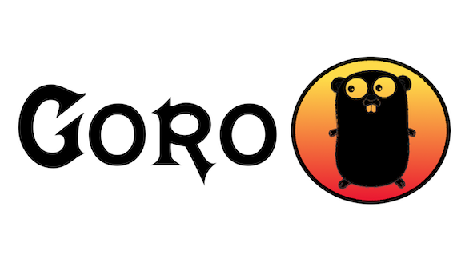

# Overview
Goro is a high-level machine learning library for Go built on [Gorgonia](https://gorgonia.org). It aims to have the same feel as [Keras](https://keras.io/).

## Usage
```go
import (
    . "github.com/aunum/goro/pkg/v1/model"
    "github.com/aunum/goro/pkg/v1/layer"
)

// create the 'x' input e.g. mnist image
x := NewInput("x", []int{1, 28, 28})

// create the 'y' or expect output e.g. labels
y := NewInput("y", []int{10})

// create a new sequential model with the name 'mnist'
model, _ := NewSequential("mnist")

// add layers to the model
model.AddLayers(
    layer.Conv2D{Input: 1, Output: 32, Width: 3, Height: 3},
    layer.MaxPooling2D{},
    layer.Conv2D{Input: 32, Output: 64, Width: 3, Height: 3},
    layer.MaxPooling2D{},
    layer.Conv2D{Input: 64, Output: 128, Width: 3, Height: 3},
    layer.MaxPooling2D{},
    layer.Flatten{},
    layer.FC{Input: 128 * 3 * 3, Output: 100},
    layer.FC{Input: 100, Output: 10, Activation: layer.Softmax},
)

// pick an optimizer
optimizer := g.NewRMSPropSolver()

// compile the model with options
model.Compile(xi, yi,
    WithOptimizer(optimizer),
    WithLoss(m.CrossEntropy),
    WithBatchSize(100),
)

// fit the model
model.Fit(xTrain, yTrain)

// Use the model to predict an 'x'
prediction, _ := model.Predict(xTest)

// fit the model with a batch
model.FitBatch(xTrainBatch, yTrainBatch)

// Use the model to predict a batch of 'x'
prediction, _ = model.PredictBatch(xTestBatch)
```

## Examples
See the [examples](./examples) folder for example implementations.

## Docs
Each package contains a README explaining the usage, also see [GoDoc](https://godoc.org/github.com/aunum/goro).

## Contributing
Please open an MR for any issues or feature requests.

Feel free to ping @pbarker on Gopher slack.

## Roadmap
- [ ] RNN
- [ ] LSTM
- [ ] Visualization
